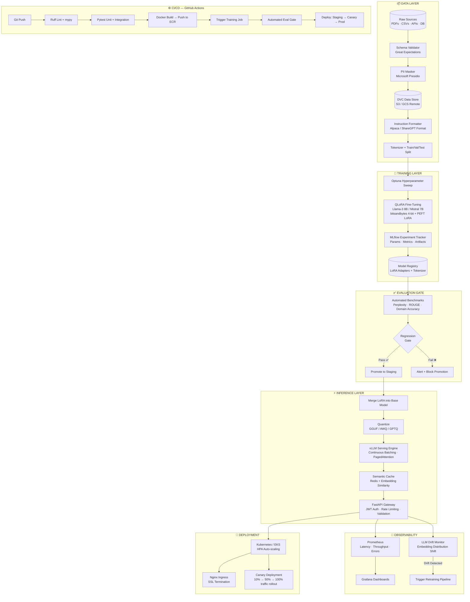

# 🧠 Llama-3 Domain-Specific Fine-Tuning — System Architecture

> **Production-grade MLOps pipeline** for domain-specific LLM fine-tuning.
> Covers the full lifecycle: raw data → versioned training → automated evaluation → scalable inference → monitored deployment.

---

## 🏗️ High-Level System Overview



---

## 📦 Layer-by-Layer Breakdown

### 1. Data Layer — Versioned & Governed

| Component | Tool | Responsibility |
|---|---|---|
| Raw Ingestion | Custom Loaders | Multi-format: PDF, CSV, API, DB dumps |
| Schema Validation | Great Expectations | Catch bad data before it enters training |
| PII Masking | Microsoft Presidio | Remove names, emails, phone numbers with audit log |
| Data Versioning | DVC + S3/GCS | Every dataset version tracked and reproducible |
| Instruction Formatting | Custom | Convert to Alpaca/ShareGPT instruction-response pairs |
| Tokenization | HuggingFace Tokenizers | Train/Val/Test split with configurable ratios |

**Key Principle:** Data enters the pipeline → it never leaves without being validated, anonymized, and versioned.

---

### 2. Training Layer — Reproducible & Tracked

| Component | Tool | Responsibility |
|---|---|---|
| Hyperparameter Search | Optuna | Automated sweep over LR, LoRA rank, batch size |
| Fine-Tuning | PEFT + bitsandbytes | QLoRA 4-bit — trains Llama-3 8B on a single 24GB GPU |
| Experiment Tracking | MLflow | Every run: params, metrics, artifacts, git commit hash |
| Model Registry | MLflow Registry | Stage management: `None → Staging → Production` |

**Key Principle:** Any training run must be fully reproducible from its MLflow run ID alone.

---

### 3. Evaluation Gate — No Regression Allowed

| Component | Metric | Threshold Logic |
|---|---|---|
| Perplexity | Lower is better | Must not exceed baseline by >5% |
| ROUGE-L | Higher is better | Must not drop below baseline by >3% |
| Domain Accuracy | Custom gold-set | 50-100 curated prompts — must pass >90% |
| Regression Gate | Automated CI step | Hard block on promotion if any metric regresses |

**Key Principle:** Bad model → never reaches production. Gate is automated, not manual.

---

### 4. Inference Layer — Low Latency at Scale

```
Request Flow:
User → FastAPI Gateway → Semantic Cache (Redis)
                              ↓ Cache Miss
                          vLLM Engine (Continuous Batching)
                              ↓
                          LoRA-merged, Quantized Model
                              ↓
                          Response → Cache → User
```

| Component | Tool | Why |
|---|---|---|
| Serving Engine | vLLM | 10-20x faster vs naive HuggingFace — Continuous Batching + PagedAttention |
| Semantic Cache | Redis + FAISS | Same/similar queries don't hit GPU → 200ms → 5ms |
| API Gateway | FastAPI + Pydantic v2 | Type-safe, async, OpenAI-compatible schema |
| Auth | JWT + API Keys | Per-client rate limiting and access control |

---

### 5. Observability — Know What's Happening

| Signal | Tool | What We Track |
|---|---|---|
| Metrics | Prometheus | Latency (p50/p95/p99), throughput, GPU utilization, error rate |
| Dashboards | Grafana | Real-time + historical views, SLO tracking |
| LLM Drift | Custom Monitor | Embedding distribution shift on incoming queries |
| Alerts | PagerDuty / Slack | Latency spike, error spike, drift detected → auto-retrain trigger |

**Drift Detection Logic:** Incoming query embeddings are compared against training data distribution. If KL-divergence exceeds threshold → retraining pipeline triggered automatically.

---

### 6. Deployment — Zero Downtime

```
Deployment Strategy: Canary Rollout

v1 (Current) ──────────────── 90% traffic
v2 (New Model) ─────────────── 10% traffic
        ↓ Monitor for 30 mins
v1 ───────────── 50% traffic
v2 ───────────── 50% traffic
        ↓ Monitor for 30 mins
v2 ─────────────────────────── 100% traffic (v1 retired)
```

| Component | Tool | Responsibility |
|---|---|---|
| Container Runtime | Docker | Isolated, reproducible environments |
| Orchestration | Kubernetes / EKS | Auto-scaling based on GPU/CPU load |
| Auto-scaling | HPA (HorizontalPodAutoscaler) | Scale inference pods on queue depth |
| Ingress | Nginx | SSL termination, load balancing |
| IaC | Terraform | Infrastructure defined as code — reproducible |

---

### 7. CI/CD Pipeline — Every Commit is Deployable

```
Git Push
    │
    ▼
┌─────────────────────────────────────────────────────┐
│  Stage 1: Quality Gates                              │
│  • Ruff linting + isort                              │
│  • mypy type checking                                │
│  • Pytest unit tests (fast, no GPU)                 │
└──────────────────────┬──────────────────────────────┘
                       │ Pass
                       ▼
┌─────────────────────────────────────────────────────┐
│  Stage 2: Build                                      │
│  • Docker image build (training + inference)         │
│  • Push to ECR / Docker Hub                         │
└──────────────────────┬──────────────────────────────┘
                       │ Pass
                       ▼
┌─────────────────────────────────────────────────────┐
│  Stage 3: Training Run (on data/config change)       │
│  • Trigger training job on EC2/SageMaker             │
│  • Log to MLflow                                     │
└──────────────────────┬──────────────────────────────┘
                       │ Complete
                       ▼
┌─────────────────────────────────────────────────────┐
│  Stage 4: Automated Evaluation Gate                  │
│  • Run benchmark suite                               │
│  • Check regression thresholds                      │
│  • Block or promote                                  │
└──────────────────────┬──────────────────────────────┘
                       │ Pass
                       ▼
┌─────────────────────────────────────────────────────┐
│  Stage 5: Deployment                                 │
│  • Deploy to Staging → run integration tests         │
│  • Canary rollout to Production                     │
│  • Monitor → full promotion or rollback             │
└─────────────────────────────────────────────────────┘
```

---

## 📁 Repository Structure

```
Llama3-Domain-Specific-FineTuning/
│
├── 📂 data/
│   ├── raw/                        # DVC-tracked, never manually edited
│   ├── processed/                  # Post-cleaning and formatting
│   ├── schemas/                    # Great Expectations validation suites
│   └── .dvc/                       # DVC config + .gitignore
│
├── 📂 src/
│   ├── 📂 data_pipeline/
│   │   ├── ingestion.py            # Multi-source loader (PDF/CSV/API)
│   │   ├── validator.py            # Schema + quality checks
│   │   ├── pii_masker.py           # Presidio-based PII removal
│   │   ├── formatter.py            # Instruction format converter
│   │   └── tokenizer.py            # Tokenizer + dataset splits
│   │
│   ├── 📂 training/
│   │   ├── qlora_trainer.py        # Main QLoRA training loop
│   │   ├── config_loader.py        # Pydantic-validated config parsing
│   │   ├── callbacks.py            # MLflow logging callbacks
│   │   └── sweep.py                # Optuna hyperparameter search
│   │
│   ├── 📂 evaluation/
│   │   ├── benchmarks.py           # Perplexity, ROUGE, domain accuracy
│   │   ├── regression_gate.py      # Automated promotion/block logic
│   │   └── report_generator.py     # HTML/JSON eval reports
│   │
│   ├── 📂 inference/
│   │   ├── engine.py               # vLLM serving wrapper
│   │   ├── api.py                  # FastAPI routes (OpenAI-compatible)
│   │   ├── auth.py                 # JWT + API key middleware
│   │   ├── cache.py                # Redis semantic cache
│   │   └── rate_limiter.py         # Per-client rate limiting
│   │
│   └── 📂 monitoring/
│       ├── metrics.py              # Prometheus metrics collectors
│       ├── drift_detector.py       # Embedding drift detection
│       └── alerting.py             # Slack / PagerDuty alerts
│
├── 📂 configs/
│   ├── training_config.yaml        # LoRA rank, LR, batch size, epochs
│   ├── inference_config.yaml       # vLLM settings, max tokens, timeout
│   └── monitoring_config.yaml      # Alert thresholds, drift sensitivity
│
├── 📂 pipelines/
│   ├── data_pipeline.py            # Prefect/Airflow orchestrated DAG
│   ├── training_pipeline.py        # End-to-end train → eval → register
│   └── deploy_pipeline.py          # Staging → Canary → Prod rollout
│
├── 📂 tests/
│   ├── unit/                       # Fast, no-GPU component tests
│   ├── integration/                # End-to-end pipeline tests
│   └── load/                       # Locust load tests for inference API
│
├── 📂 docker/
│   ├── Dockerfile.training         # GPU-enabled training image
│   ├── Dockerfile.inference        # Optimized inference image (slim)
│   └── docker-compose.yaml         # Full local dev stack
│
├── 📂 k8s/
│   ├── deployment.yaml             # Pod spec + resource limits
│   ├── hpa.yaml                    # Horizontal Pod Autoscaler config
│   ├── ingress.yaml                # Nginx ingress + TLS
│   └── helm/                       # Helm chart for one-command deploy
│
├── 📂 terraform/
│   ├── main.tf                     # EC2/EKS cluster provisioning
│   ├── variables.tf                # Parameterized infra config
│   └── outputs.tf                  # Endpoint URLs, ARNs
│
├── 📂 .github/workflows/
│   ├── ci.yaml                     # Lint → Test → Docker Build
│   ├── training.yaml               # Triggered on data or config changes
│   └── deploy.yaml                 # Staging → Canary → Production
│
├── 📂 notebooks/
│   ├── 01_data_exploration.ipynb   # EDA — never runs in production
│   └── 02_model_eval_analysis.ipynb
│
├── dvc.yaml                        # DVC pipeline DAG definition
├── MLproject                       # MLflow project entrypoint
├── pyproject.toml                  # Dependencies + tool config (ruff, mypy)
└── Makefile                        # `make train`, `make eval`, `make deploy`
```

---

## 🔧 Technology Stack

| Layer | Technology | Rationale |
|---|---|---|
| Data Versioning | DVC + S3 | Git tracks code, DVC tracks data — full experiment reproducibility |
| Data Validation | Great Expectations | Declarative data quality — catches issues before training, not after |
| PII Masking | Microsoft Presidio | Enterprise-grade, auditable anonymization |
| Experiment Tracking | MLflow | Every run: params, metrics, artifacts, code snapshot |
| Hyperparameter Tuning | Optuna | Bayesian optimization — smarter than grid/random search |
| Fine-Tuning | PEFT + bitsandbytes | QLoRA: 4-bit quantized training — Llama-3 8B on single 24GB GPU |
| Inference Engine | vLLM | Continuous Batching + PagedAttention — 10-20x vs HuggingFace naive serving |
| Semantic Cache | Redis + FAISS | Identical/similar queries never hit GPU — 200ms → 5ms |
| API Framework | FastAPI + Pydantic v2 | Async, type-safe, OpenAI-compatible schema |
| Pipeline Orchestration | Prefect / Apache Airflow | Pipelines as observable DAGs — retries, logging, scheduling |
| Containerization | Docker + Kubernetes | Reproducible environments + auto-scaling |
| IaC | Terraform | Infrastructure is code — one command to spin up entire stack |
| CI/CD | GitHub Actions | Every commit linted, tested, built, and deployable |
| Monitoring | Prometheus + Grafana | Real-time latency, throughput, GPU utilization dashboards |
| LLM Drift Detection | Custom (FAISS + KL-div) | Know when incoming queries diverge from training distribution |
| Alerting | Slack / PagerDuty | Immediate notification on SLO breach or drift detection |

---

## 📐 Design Principles

1. **Reproducibility First** — Any training run must be fully reproducible from its MLflow run ID: same data version (DVC), same config, same code commit.

2. **Fail Fast, Fail Loud** — Schema validation catches bad data at ingestion. Regression gate blocks bad models at evaluation. Nothing silently passes.

3. **Decouple Training from Serving** — LoRA adapters are merged and quantized before serving. Inference layer knows nothing about training infrastructure.

4. **Observability by Default** — Every service emits metrics. Every pipeline step is logged. Drift is detected automatically, not discovered by users.

5. **Infrastructure as Code** — No manual AWS console clicks. Terraform provisions everything. Anyone can reproduce the infrastructure.
