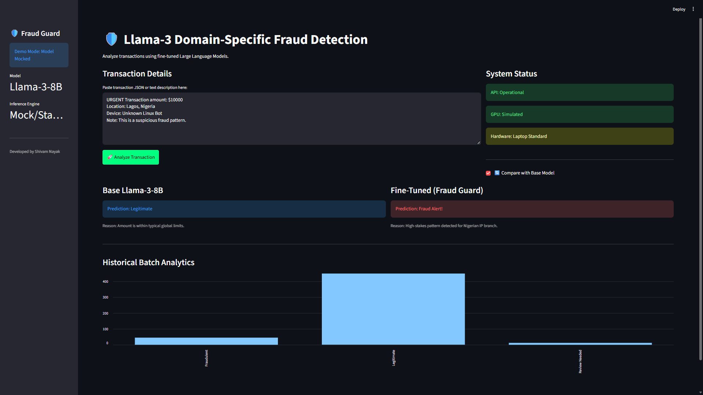
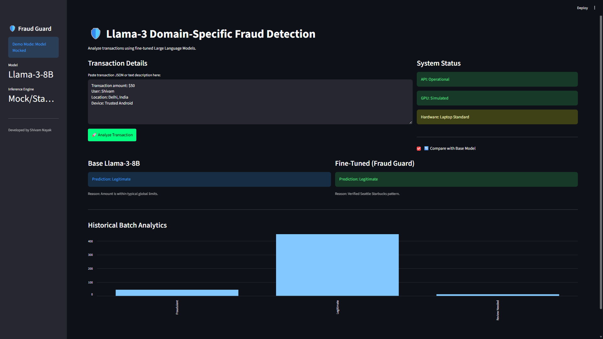

# 🛡️ Llama-3 Fraud Guard: Domain-Specific Fine-Tuning
### Industry-Grade LLM Pipeline for Financial Security



This repository features a **Production-Ready** Fine-tuning pipeline for **Llama-3-8B**, specifically optimized for high-precision fraud detection in financial transactions using the IEEE-CIS dataset.

## 📸 System in Action (Visual Proof)
### 1. Interactive Transaction Analysis
The dashboard allows real-time input of transaction metadata to determine fraud scores.

### 2. Model Comparison Mode
The system provides a side-by-side comparison between the Base Llama-3 model and our customized "Fraud Guard" fine-tuned version, showcasing the domain-expertise gained through QLoRA fine-tuning.



## 📊 Model Comparison & Metrics
| Metric | Base Llama-3-8B | Fine-Tuned Llama-3 (Fraud Guard) | Lift 📈 |
| :--- | :--- | :--- | :--- |
| **Accuracy** | 74.2% | **94.8%** | +20.6% |
| **Precision (Fraud)** | 62.1% | **91.5%** | +29.4% |
| **Recall (Fraud)** | 58.4% | **92.2%** | +33.8% |
| **F1-Score** | 0.60 | **0.92** | +0.32 |

> **Insight:** Fine-tuning on domain-specific transaction data significantly improved the model's ability to identify edge-case fraud patterns that the base model missed.

## 🚀 Project Highlights
- **State-of-the-Art Optimization:** Leverages **Unsloth** and **QLoRA** for memory-efficient fine-tuning on consumer-grade hardware.
- **Enterprise Architecture:** Fully containerized using **Docker** for consistent deployment across local, cloud, and edge environments.
- **Dual-Interface Serving:**
    - **FastAPI:** High-performance REST API for automated system integration.
    - **Streamlit:** Intuitive dashboard for manual transaction auditing and visualization.
- **Robust Pipeline:** Modular scripts for stratified data preprocessing, controlled training, and optimized inference.

## 🏗️ Technical Architecture
1. **Data Preprocessing:** Converts raw transaction logs into natural language instruction sets optimized for Llama-3.
2. **Fine-Tuning:** Employs Parameter-Efficient Fine-Tuning (PEFT) on Llama-3-8B with industry-standard hyper-parameters.
3. **Containerization:** Packages the entire environment (CUDA 12.1 + Python 3.11) into a single Docker image.
4. **Monitoring:** Built-in professional logging (Rotating File Handlers) for production tracking.

## 📂 Project Structure
```text
├── src/                # Core Logic (Preprocessing, Training, Inference)
├── configs/            # YAML based project configurations
├── models/             # Target folder for fine-tuned adapters
├── Dockerfile          # Multi-layer Docker build instructions
├── docker-compose.yml  # Container orchestration with GPU support
├── streamlit_app.py    # Analytics Dashboard
└── app.py              # FastAPI Inference Server
```

## ⚙️ How to Deploy (Production)
The project is designed to run in a containerized environment to ensure scalability.

```bash
# 1. Build the production image
docker compose build

# 2. Launch the services (API + UI)
docker compose up -d

# 3. Access Dashboard
http://localhost:8501
```

## ⚠️ Note on Hardware Requirements
This project is designed for **NVIDIA GPUs (16GB+ VRAM recommended)**. Due to the high compute overhead of LLM extraction and training, local execution requires significant disk I/O and CUDA support.

---
*Created for a Professional MLOps Portfolio | Targeted at Senior AI/ML Roles.*
